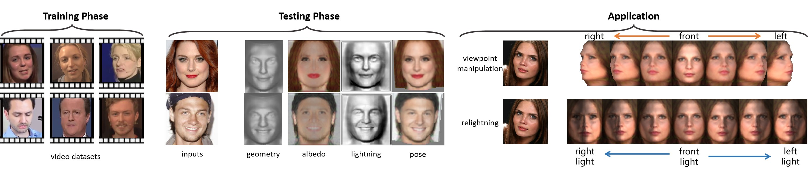

# KDFReVS-3D
Repository for 《A Distillation Framework for Accurate and Robust Single View 3D Face Reconstruction with Video Supervision》




### Dependencies

- pytorch  >= 1.0
- tensorboardX
- pyyaml
- opencv
- neural_renderer_pytorch

Note that neural_renderer_pytorch may fail if you install it on Win10, in this case, please refer to [https://github.com/lstcutong/neural_renderer_pytorch-win10](https://github.com/lstcutong/neural_renderer_pytorch-win10) for solution.

### Datasets

1. 300VW.                Please download original video from [300VW](https://ibug.doc.ic.ac.uk/resources/300-VW/).
2. YTF.                      Please download original video from [youtube](http://www.cs.tau.ac.il/~wolf/ytfaces/).
3. CelebA.                Please download original images from [CelebA](http://mmlab.ie.cuhk.edu.hk/projects/CelebA.html).
4. synface.               Please download original images from [synface](https://github.com/elliottwu/unsup3d).
5. AFLW2000-3D.    Please download original images from [AFLW2000-3D](http://www.cbsr.ia.ac.cn/users/xiangyuzhu/projects/3DDFA/main.htm).

Please remember to cite the corresponding papers if you use these datasets.

### Data preprocessing

All preprocessing tools have been provided in [https://github.com/lstcutong/video-face-3d](https://github.com/lstcutong/video-face-3d), please refer to it for more details.

For training, after preprocessing 300VW and YTF datasets, put them in `./datasets/train`,  one video in one folder, we provide an example for your reference. You can add more videos in it if you like. Note that we need some single face images for evaluation during training, please put any images you like in `./datasets/val`.

For testing, we have provided some images that used in paper in `./datasets/test`, you can directly run our code to verify the performance that demonstrated in our paper. You can also put some other images and test your own.

### Pretrained Models

Download pretrained models from [models.zip](https://pan.baidu.com/s/1axOuk5K-rgSNLAvj3JkQGw)  (password: fvq1) and extract them into `./models`

### Training and Testing

for training

```python
python train_test.py --config ./configs/train_video_gru.yml --gpu 0 --num_workers 4
```

for testing

```python
python train_test.py --config ./configs/test_single_image.yml
```

the results are saved in `./results`

### Example results

